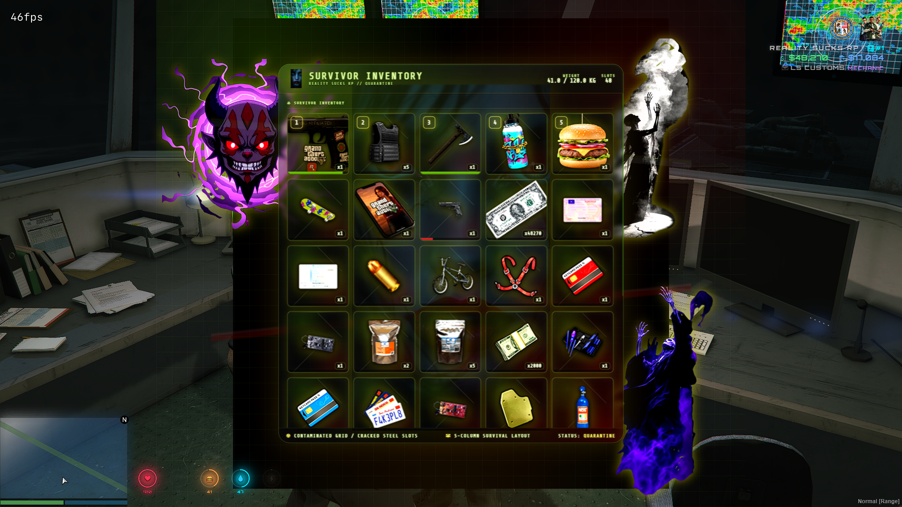

<p align="center">
  
  
</p>
# RealitySucksRP Zombie Inventory - Open Source

This is the open-source Zombie UI version of QB Inventory Rework for QBCore servers.

This package is meant to be delivered as a normal Tebex file download. It is not an escrow package and does not use `/assetpacks`.

All Lua, HTML, CSS, JavaScript, config files, item images, and Zombie UI artwork are editable.

## Tebex Delivery Note

Use this resource as a normal downloadable ZIP product.

Do not advertise it as Cfx Granted or escrow protected. This release is open source, so buyers receive the editable files directly.

Install folder name:

```text
qb-inventory
```

Start order example:

```cfg
ensure qb-core
ensure qb-weapons
ensure oxmysql
ensure qb-inventory
```

## HUD Money Sync

This inventory includes cash-as-item support. That means the cash item inside the inventory can match the money shown on the player's HUD.

The HUD config included with this resource is only an example. This inventory does **not** require `rs-lilhudlife`.

Server owners must replace the example HUD resource name and event with the HUD they actually use on their server.

Open:

```text
config/config.lua
```

Find:

```lua
CustomHUD = {
    Enabled = false,
    ResourceName = 'your-hud-resource',
    ExportName = 'SetHUDLifeVisible',
    MoneySyncEvents = {}
}
```

Leave `Enabled = false` if you do not want this inventory to send money updates to a custom HUD.

Set `Enabled = true` only if you want this inventory to notify your HUD when the player's cash amount changes.

Example:

```lua
CustomHUD = {
    Enabled = true,
    ResourceName = 'my-hud',
    ExportName = nil,
    MoneySyncEvents = {
        'my-hud:client:updateCash'
    }
}
```

Your HUD must have an event that accepts the new cash amount.

Example HUD-side code:

```lua
RegisterNetEvent('my-hud:client:updateCash', function(cashAmount)
    -- Update your HUD cash display here.
    -- cashAmount is the player's current cash amount.
end)
```

If your HUD already has its own money update event, add that event name inside `MoneySyncEvents`.

Example:

```lua
MoneySyncEvents = {
    'hud:client:UpdateMoney',
    'myhud:client:setCash'
}
```

Do not leave the example HUD name in place unless that is the HUD you actually use.

`rs-lilhudlife` is only an example from the RealitySucksRP test server. Replace it with your own HUD resource name, export, or event.

### Quick HUD Setup

1. Open `config/config.lua`.
2. Find `CustomHUD`.
3. Change `ResourceName` to your HUD resource name.
4. Add your HUD cash update event inside `MoneySyncEvents`.
5. Set `Enabled = true`.
6. Restart `qb-inventory`.
7. Buy, drop, deposit, or receive cash and confirm the HUD amount matches the inventory cash item.

### Important

If your HUD does not update after setup, check your HUD documentation for the correct client event or export used to update cash/money display.

This resource cannot automatically know every custom HUD event name. The server owner must enter the correct HUD event or export for their own HUD.

---

## Tebex / Server Owner Notes

This is the open-source Zombie UI version. It is not escrowed and it does not use `/assetpacks`.

The HUD settings in `config/config.lua` are examples only. This resource may show `rs-lilhudlife` in comments because that is the RealitySucksRP test HUD, but buyers are expected to replace it with their own HUD resource name, their own export, or leave the option disabled.

Cash display works like this:

- `qb-inventory` always sends the current cash item total with this client event:

```lua
RegisterNetEvent('qb-inventory:client:updateCash', function(cashAmount)
    -- Update your HUD cash display here
end)
```

- Server owners can also add their own HUD event name in `Config.CustomHUD.MoneySyncEvents`.
- If `Config.CashAsItem = true`, the `cash` item count is the real cash balance. The HUD must display the cash item count, not an old cached QBCore money value.
- If a server does not use cash-as-item, set `Config.CashAsItem = false` and keep normal QBCore money behavior.

Example custom HUD setup in `config/config.lua`:

```lua
CustomHUD = {
    Enabled = false, -- only turn this on if your HUD has a hide/show export
    ResourceName = 'your-hud-resource',
    ExportName = 'SetHUDVisible',
    MoneySyncEvents = {
        'yourhud:client:updateCash'
    }
}
```

`rs-lilhudlife` is not required. It is only an example from the RealitySucksRP server.

\---


##   Core Features

* Cash as an item
* New give system
* Rob Player
* Decay system for food \& drinks
* Weapon attachment panel
* New 2-panel UI layout
* Toggle blur effect
* Code modifications for optimization \& security

\---


##   Dependencies

Ensure you have the following resources installed and running before installing qb-Inventory rework :

* qb-core and qb-weapons

\---

##    Installation

Follow these steps **very carefully** to ensure a smooth installation. Hit me up on discord if you cant do this. 

### Step 1: Download \& Place the Resource

1. Download this resource's files
2. Double check is unsure on your server.cfg should read qb-inventory same name as original. 
3. delete your old inventory files and replace with `qb-inventory` zombie design. 

### Step 2: Modify `qb-core`

**IMPORTANT: Always create a backup of any file you are about to edit!**

You need to edit the `qb-core/server/player.lua` file to integrate the money-as-an-item system.

#### A. Replace Money Management Functions

Open `qb-core/server/player.lua` and find the following functions:

* `self.Functions.AddMoney`
* `self.Functions.RemoveMoney`
* `self.Functions.SetMoney`
* `self.Functions.GetMoney`

Delete all four of these functions entirely and replace them with the code block below:


    function self.Functions.AddMoney(moneytype, amount, reason)
    reason = reason or 'unknown'
    moneytype = moneytype:lower()
    amount = tonumber(amount)
    if amount < 0 then return end
    if not self.PlayerData.money\[moneytype] then return false end

    if moneytype == 'cash' and GetResourceState('qb-inventory') \~= 'missing' and exports\['qb-inventory']:IsCashAsItem() then
        if exports\['qb-inventory']:AddCash(self.PlayerData.source, amount) then
            local newCashAmount = exports\['qb-inventory']:GetItemCount(self.PlayerData.source, 'cash') or 0
            self.PlayerData.money.cash = newCashAmount
            if not self.Offline then
                self.Functions.UpdatePlayerData()
                if amount > 100000 then
                    TriggerEvent('qb-log:server:CreateLog', 'playermoney', 'AddMoney (as item)', 'lightgreen', '\*\*' .. GetPlayerName(self.PlayerData.source) .. ' (citizenid: ' .. self.PlayerData.citizenid .. ' | id: ' .. self.PlayerData.source .. ')\*\* $' .. amount .. ' (cash) added, reason: ' .. reason, true)
                else
                    TriggerEvent('qb-log:server:CreateLog', 'playermoney', 'AddMoney (as item)', 'lightgreen', '\*\*' .. GetPlayerName(self.PlayerData.source) .. ' (citizenid: ' .. self.PlayerData.citizenid .. ' | id: ' .. self.PlayerData.source .. ')\*\* $' .. amount .. ' (cash) added, reason: ' .. reason)
                end
                TriggerClientEvent('hud:client:OnMoneyChange', self.PlayerData.source, moneytype, amount, false)
                TriggerClientEvent('QBCore:Client:OnMoneyChange', self.PlayerData.source, moneytype, amount, 'add', reason)
                TriggerEvent('QBCore:Server:OnMoneyChange', self.PlayerData.source, moneytype, amount, 'add', reason)
            end
            return true
        else
            return false
        end
    end

    self.PlayerData.money\[moneytype] = self.PlayerData.money\[moneytype] + amount
    if not self.Offline then
        self.Functions.UpdatePlayerData()
        if amount > 100000 then
            TriggerEvent('qb-log:server:CreateLog', 'playermoney', 'AddMoney', 'lightgreen', '\*\*' .. GetPlayerName(self.PlayerData.source) .. ' (citizenid: ' .. self.PlayerData.citizenid .. ' | id: ' .. self.PlayerData.source .. ')\*\* $' .. amount .. ' (' .. moneytype .. ') added, new ' .. moneytype .. ' balance: ' .. self.PlayerData.money\[moneytype] .. ' reason: ' .. reason, true)
        else
            TriggerEvent('qb-log:server:CreateLog', 'playermoney', 'AddMoney', 'lightgreen', '\*\*' .. GetPlayerName(self.PlayerData.source) .. ' (citizenid: ' .. self.PlayerData.citizenid .. ' | id: ' .. self.PlayerData.source .. ')\*\* $' .. amount .. ' (' .. moneytype .. ') added, new ' .. moneytype .. ' balance: ' .. self.PlayerData.money\[moneytype] .. ' reason: ' .. reason)
        end
        TriggerClientEvent('hud:client:OnMoneyChange', self.PlayerData.source, moneytype, amount, false)
        TriggerClientEvent('QBCore:Client:OnMoneyChange', self.PlayerData.source, moneytype, amount, 'add', reason)
        TriggerEvent('QBCore:Server:OnMoneyChange', self.PlayerData.source, moneytype, amount, 'add', reason)
    end
    return true
end

    function self.Functions.RemoveMoney(moneytype, amount, reason)
    reason = reason or 'unknown'
    moneytype = moneytype:lower()
    amount = tonumber(amount)
    if amount < 0 then return end
    if not self.PlayerData.money\[moneytype] then return false end

    if moneytype == 'cash' and GetResourceState('qb-inventory') \~= 'missing' and exports\['qb-inventory']:IsCashAsItem() then
        if exports\['qb-inventory']:RemoveCash(self.PlayerData.source, amount, reason) then
            local newCashAmount = exports\['qb-inventory']:GetItemCount(self.PlayerData.source, 'cash') or 0
            self.PlayerData.money.cash = newCashAmount
            if not self.Offline then
                self.Functions.UpdatePlayerData()
                if amount > 100000 then
                    TriggerEvent('qb-log:server:CreateLog', 'playermoney', 'RemoveMoney (as item)', 'red', '\*\*' .. GetPlayerName(self.PlayerData.source) .. ' (citizenid: ' .. self.PlayerData.citizenid .. ' | id: ' .. self.PlayerData.source .. ')\*\* $' .. amount .. ' (cash) removed, reason: ' .. reason, true)
                else
                    TriggerEvent('qb-log:server:CreateLog', 'playermoney', 'RemoveMoney (as item)', 'red', '\*\*' .. GetPlayerName(self.PlayerData.source) .. ' (citizenid: ' .. self.PlayerData.citizenid .. ' | id: ' .. self.PlayerData.source .. ')\*\* $' .. amount .. ' (cash) removed, reason: ' .. reason)
                end
                TriggerClientEvent('hud:client:OnMoneyChange', self.PlayerData.source, moneytype, amount, true)
                TriggerClientEvent('QBCore:Client:OnMoneyChange', self.PlayerData.source, moneytype, amount, 'remove', reason)
                TriggerEvent('QBCore:Server:OnMoneyChange', self.PlayerData.source, moneytype, amount, 'remove', reason)
            end
            return true
        else
            return false
        end
    end

    for \_, mtype in pairs(QBCore.Config.Money.DontAllowMinus) do
        if mtype == moneytype then
            if (self.PlayerData.money\[moneytype] - amount) < 0 then
                return false
            end
        end
    end
    if self.PlayerData.money\[moneytype] - amount < QBCore.Config.Money.MinusLimit then
        return false
    end
    self.PlayerData.money\[moneytype] = self.PlayerData.money\[moneytype] - amount
    if not self.Offline then
        self.Functions.UpdatePlayerData()
        if amount > 100000 then
            TriggerEvent('qb-log:server:CreateLog', 'playermoney', 'RemoveMoney', 'red', '\*\*' .. GetPlayerName(self.PlayerData.source) .. ' (citizenid: ' .. self.PlayerData.citizenid .. ' | id: ' .. self.PlayerData.source .. ')\*\* $' .. amount .. ' (' .. moneytype .. ') removed, new ' .. moneytype .. ' balance: ' .. self.PlayerData.money\[moneytype] .. ' reason: ' .. reason, true)
        else
            TriggerEvent('qb-log:server:CreateLog', 'playermoney', 'RemoveMoney', 'red', '\*\*' .. GetPlayerName(self.PlayerData.source) .. ' (citizenid: ' .. self.PlayerData.citizenid .. ' | id: ' .. self.PlayerData.source .. ')\*\* $' .. amount .. ' (' .. moneytype .. ') removed, new ' .. moneytype .. ' balance: ' .. self.PlayerData.money\[moneytype] .. ' reason: ' .. reason)
        end
        TriggerClientEvent('hud:client:OnMoneyChange', self.PlayerData.source, moneytype, amount, true)
        if moneytype == 'bank' then
            TriggerClientEvent('qb-phone:client:RemoveBankMoney', self.PlayerData.source, amount)
        end
        TriggerClientEvent('QBCore:Client:OnMoneyChange', self.PlayerData.source, moneytype, amount, 'remove', reason)
        TriggerEvent('QBCore:Server:OnMoneyChange', self.PlayerData.source, moneytype, amount, 'remove', reason)
    end
    return true
end

    function self.Functions.SetMoney(moneytype, amount, reason)
    reason = reason or 'unknown'
    moneytype = moneytype:lower()
    amount = tonumber(amount)
    if amount < 0 then return false end
    if not self.PlayerData.money\[moneytype] then return false end

    if moneytype == 'cash' and GetResourceState('qb-inventory') \~= 'missing' and exports\['qb-inventory']:IsCashAsItem() then
        local currentCash = exports\['qb-inventory']:GetItemCount(self.PlayerData.source, 'cash') or 0
        local difference = amount - currentCash
        local success = false
        if difference > 0 then
            success = exports\['qb-inventory']:AddItem(self.PlayerData.source, 'cash', difference, nil, {}, 'setmoney\_command')
        elseif difference < 0 then
            success = exports\['qb-inventory']:RemoveItem(self.PlayerData.source, 'cash', math.abs(difference), nil, 'setmoney\_command')
        else
            success = true
        end
        if success then
            local newTotalCash = exports\['qb-inventory']:GetItemCount(self.PlayerData.source, 'cash') or 0
            self.PlayerData.money.cash = newTotalCash
            if not self.Offline then
                self.Functions.UpdatePlayerData()
                local difference = newTotalCash - (currentCash or 0)
                TriggerEvent('qb-log:server:CreateLog', 'playermoney', 'SetMoney (as item)', 'green', '\*\*' .. GetPlayerName(self.PlayerData.source) .. ' (citizenid: ' .. self.PlayerData.citizenid .. ' | id: ' .. self.PlayerData.source .. ')\*\* cash set to $' .. newTotalCash .. ', reason: ' .. reason)
                TriggerClientEvent('hud:client:OnMoneyChange', self.PlayerData.source, moneytype, math.abs(difference), difference < 0)
                TriggerClientEvent('QBCore:Client:OnMoneyChange', self.PlayerData.source, moneytype, newTotalCash, 'set', reason)
                TriggerEvent('QBCore:Server:OnMoneyChange', self.PlayerData.source, moneytype, newTotalCash, 'set', reason)
                TriggerClientEvent('qb-inventory:client:updateCash', self.PlayerData.source, newTotalCash)
            end
        end
        return success
    end

    local difference = amount - self.PlayerData.money\[moneytype]
    self.PlayerData.money\[moneytype] = amount
    if not self.Offline then
        self.Functions.UpdatePlayerData()
        TriggerEvent('qb-log:server:CreateLog', 'playermoney', 'SetMoney', 'green', '\*\*' .. GetPlayerName(self.PlayerData.source) .. ' (citizenid: ' .. self.PlayerData.citizenid .. ' | id: ' .. self.PlayerData.source .. ')\*\* $' .. amount .. ' (' .. moneytype .. ') set, new ' .. moneytype .. ' balance: ' .. self.PlayerData.money\[moneytype] .. ' reason: ' .. reason)
        TriggerClientEvent('hud:client:OnMoneyChange', self.PlayerData.source, moneytype, math.abs(difference), difference < 0)
        TriggerClientEvent('QBCore:Client:OnMoneyChange', self.PlayerData.source, moneytype, amount, 'set', reason)
        TriggerEvent('QBCore:Server:OnMoneyChange', self.PlayerData.source, moneytype, amount, 'set', reason)
    end
    return true
end

    function self.Functions.GetMoney(moneytype)
    if not moneytype then return false end
    moneytype = moneytype:lower()

    if moneytype == 'cash' and GetResourceState('qb-inventory') \~= 'missing' and exports\['qb-inventory']:IsCashAsItem() then
        local cashCount = exports\['qb-inventory']:GetItemCount(self.PlayerData.source, 'cash') or 0
        if self.PlayerData.money.cash \~= cashCount then
            self.PlayerData.money.cash = cashCount
        end
        return cashCount
    end

    return self.PlayerData.money\[moneytype]
end


#### B. Replace the `CheckPlayerData` Function

Still in `qb-core/server/player.lua`, find the function `QBCore.Player.CheckPlayerData`. Delete this function and replace it with the code block below. This change ensures the player's inventory is loaded correctly when they join the server.


function QBCore.Player.CheckPlayerData(source, PlayerData)
    PlayerData = PlayerData or {}
    local Offline = not source
    if source then
        PlayerData.source = source
        PlayerData.license = PlayerData.license or QBCore.Functions.GetIdentifier(source, 'license')
        PlayerData.name = GetPlayerName(source)
    end
    local validatedJob = false
    if PlayerData.job and PlayerData.job.name \~= nil and PlayerData.job.grade and PlayerData.job.grade.level \~= nil then
        local jobInfo = QBCore.Shared.Jobs\[PlayerData.job.name]
        if jobInfo then
            local jobGradeInfo = jobInfo.grades\[tostring(PlayerData.job.grade.level)]
            if jobGradeInfo then
                PlayerData.job.label = jobInfo.label
                PlayerData.job.grade.name = jobGradeInfo.name
                PlayerData.job.payment = jobGradeInfo.payment
                PlayerData.job.grade.isboss = jobGradeInfo.isboss or false
                PlayerData.job.isboss = jobGradeInfo.isboss or false
                validatedJob = true
            end
        end
    end
    if validatedJob == false then
        PlayerData.job = nil
    end
    local validatedGang = false
    if PlayerData.gang and PlayerData.gang.name \~= nil and PlayerData.gang.grade and PlayerData.gang.grade.level \~= nil then
        local gangInfo = QBCore.Shared.Gangs\[PlayerData.gang.name]
        if gangInfo then
            local gangGradeInfo = gangInfo.grades\[tostring(PlayerData.gang.grade.level)]
            if gangGradeInfo then
                PlayerData.gang.label = gangInfo.label
                PlayerData.gang.grade.name = gangGradeInfo.name
                PlayerData.gang.payment = gangGradeInfo.payment
                PlayerData.gang.grade.isboss = gangGradeInfo.isboss or false
                PlayerData.gang.isboss = gangGradeInfo.isboss or false
                validatedGang = true
            end
        end
    end
    if validatedGang == false then
        PlayerData.gang = nil
    end
    applyDefaults(PlayerData, QBCore.Config.Player.PlayerDefaults)
    if GetResourceState('qb-inventory') \~= 'missing' then
        PlayerData.items = exports\['qb-inventory']:LoadInventory(PlayerData.source, PlayerData.citizenid)
        if exports\['qb-inventory']:IsCashAsItem() then
            if PlayerData.items then
                local cashInInventory = 0
                for \_, item in pairs(PlayerData.items) do
                    if item and item.name == 'cash' then
                        cashInInventory = cashInInventory + item.amount
                    end
                end
                PlayerData.money.cash = cashInInventory
            end
        end
    end
    return QBCore.Player.CreatePlayer(PlayerData, Offline)
end


### Step 3: Add Cash Item to `qb-core/shared/items.lua`


cash = { name = 'cash', label = 'Cash', weight = 0, type = 'item', image = 'cash.png', unique = false, useable = false, shouldClose = false, description = 'Don't spend it all in one place.'},


### Step 4: Add Decay Rate to Food and Drinks

To make food and drinks perishable, you need to add a decay rate to them.
Open qb-core/shared/items.lua and for every food and drink item, add the following line inside its definition:

`decayrate = 86400.0`

EXAMPLE :


sandwich = {
    name = 'sandwich',
    label = 'Sandwich',
    weight = 200,
    type = 'item',
    image = 'sandwich.png',
    unique = false,
    useable = true,
    shouldClose = true,
    description = 'Nice bread for your stomach',
    decayrate = 86400.0
},


If you encounter any issues, require assistance, or wish to suggest new features, please join my official Discord server. I am here to help!


##  Configuration

All major configuration options can be found in the `config.lua` file. You can adjust:

* The default keybind to open the inventory.
* Maximum weight and slot counts.
* Storage sizes for trunks, gloveboxes, and drops.
* Items sold in Vending Machines.
* And much more.

\---

## Special thanks to the QBCore community for their support and inspiration. Also, major thanks to Anya-project qb-inventory reworked for their patches and updates. 


Original resource by the QBCore Framework team -- \[qbcore-framework/qb-inventory](https://github.com/qbcore-framework/qb-inventory)

And of course thanks to https://github.com/Anya-Project/qb-inventory-rework  for all the patches and updates.


**How to replace menu ui images or move them around.**


\# Moving Menu UI Images - Zombie qb-inventory

REMEMBER TO USE .PNG AND A BACKGROUND REMOVAL FOR BETTER VISUALS

This zombie inventory uses a custom zombie menu UI, custom images, and a different visual design. The backend inventory logic should not be edited when moving images.


Move zombie images through CSS only.


Safe file to edit:


`qb-inventory/html/main.css`


The zombie image elements are placed in:


`qb-inventory/html/index.html`


But you usually do not need to edit `index.html` unless you are adding a new image.


Do not edit these files just to move images:


`html/app.js`  

`client/main.lua`  

`server/main.lua`  

`server/functions.lua`  

`config/config.lua`


Those files control the inventory system, item usage, hotkeys, drops, cash-as-item, and server sync.


\## Zombie Image Elements


The zombie UI uses these main image pieces:


`zhead`  

`zbody`  

`zskelly`  

`rslogo`


They are controlled mainly in:


`qb-inventory/html/main.css`


\## Main Zombie Image Controls


Look in `main.css` for a section like this:


`:root {

&#x20;   --rs-zhead-left: -275px;

&#x20;   --rs-zhead-top: -42px;


&#x20;   --rs-zbody-right: -280px;

&#x20;   --rs-zbody-top: -72px;


&#x20;   --rs-zskelly-right: -245px;

&#x20;   --rs-zskelly-bottom: -175px;


&#x20;   --rs-zhead-width: 485px;

&#x20;   --rs-zhead-height: 540px;


&#x20;   --rs-zbody-width: 485px;

&#x20;   --rs-zbody-height: 565px;


&#x20;   --rs-zskelly-width: 520px;

&#x20;   --rs-zskelly-height: 660px;

}`


## What Each Setting Does


`--rs-zhead-left` moves the zombie head left or right.  

`--rs-zhead-top` moves the zombie head up or down.


`--rs-zbody-right` moves the zombie body left or right from the right side.  

`--rs-zbody-top` moves the zombie body up or down.


`--rs-zskelly-right` moves the skeleton left or right from the right side.  

`--rs-zskelly-bottom` moves the skeleton up or down from the bottom.


`width` and `height` make each image bigger or smaller.


## Examples


Move zombie head farther left:


`--rs-zhead-left: -330px;`


Move zombie head down:


`--rs-zhead-top: 20px;`


Move zombie body farther right:


`--rs-zbody-right: -330px;`


Move zombie body closer to the menu:


`--rs-zbody-right: -180px;`


Move skeleton up:


`--rs-zskelly-bottom: -80px;`


Make skeleton bigger:


`--rs-zskelly-width: 600px;`  

`--rs-zskelly-height: 760px;`


## Moving the Logo


The logo or watermark is usually controlled by:


`.rs-menu-watermark {

&#x20;   background-image: url("rslogo.png") !important;

&#x20;   background-position: center !important;

&#x20;   background-size: contain !important;

&#x20;   inset: 58px 10% 30px 10% !important;

}`


The `inset` value controls the image position.


Order:


`top right bottom left`


Example:


`inset: 35px 8% 40px 8%;`


That means:


35px from the top  

8% from the right  

40px from the bottom  

8% from the left


\## Adding a New Zombie Image


Place the PNG inside:


`qb-inventory/html/`


or inside your UI image folder if your design uses one.


Then add a new div in:


`qb-inventory/html/index.html`


Example:


`<div class="zombie-extra-art"></div>`


Then style it in:


`qb-inventory/html/main.css`


Example:


`.zombie-extra-art {

&#x20;   position: absolute;

&#x20;   background-image: url("zombie-extra.png");

&#x20;   background-size: contain;

&#x20;   background-repeat: no-repeat;

&#x20;   background-position: center;

&#x20;   width: 500px;

&#x20;   height: 500px;

&#x20;   right: -120px;

&#x20;   top: 80px;

&#x20;   pointer-events: none;

&#x20;   z-index: 0;

}`


\## After Editing


Restart the inventory resource:


`restart qb-inventory`


If the image does not move, clear FiveM cache or fully restart the client.

# qb-core

# Attachment Compatibility Fix Notes

## Problem

Players could open the weapon attachment menu, but removing attachments caused errors like:

```txt
[qb-inventory] RemoveAttachment blocked:
missing QBCore.Shared.Items entry for carbine_extendedclip

[qb-inventory] RemoveAttachment blocked:
missing QBCore.Shared.Items entry for pistol_suppressor_only
```

The attachment UI could also appear empty or broken.

---

# Why This Happens

qb-inventory attachment removal works by:

1. removing the attachment component from the weapon
2. giving the player a real inventory item back

Example:

* remove extended mag
* player receives `carbine_extendedclip`

BUT...

If the attachment item does NOT exist inside:

```txt
qb-core/shared/items.lua
```

then qb-inventory blocks the removal to prevent:

* ghost items
* nil items
* exploit duplication
* broken inventory states

This is a safety protection, not a qb-inventory bug.

---

# Fix

Add missing attachment item definitions to:

```txt
qb-core/shared/items.lua
```

Example:

```lua
carbine_extendedclip = {name = 'carbine_extendedclip', label = 'Carbine Extended Clip', weight = 250, type = 'item', image = 'carbine_extendedclip.png', unique = false, useable = true, shouldClose = true, combinable = nil, description = 'Extended magazine attachment for compatible carbine rifles.'},

pistol_suppressor_only = {name = 'pistol_suppressor_only', label = 'Pistol Suppressor', weight = 250, type = 'item', image = 'pistol_suppressor_only.png', unique = false, useable = true, shouldClose = true, combinable = nil, description = 'Suppressor attachment for compatible pistols.'},
```

Also ensure matching images exist inside:

```txt
qb-inventory/html/images/
```

---

# Important

Every attachment removable through qb-inventory MUST:

* exist in `QBCore.Shared.Items`
* have a valid image
* use the exact same item name/key

Otherwise:

* removal fails
* UI may appear broken
* attachments may not return properly

---

# Restart Order

After adding attachment items:

```txt
restart qb-core
restart qb-weapons
restart qb-inventory
```

---

# Notes For Custom Servers

If your server uses:

* custom weapon attachments
* renamed attachment keys
* custom weapon systems

you MUST create matching inventory item entries for every removable attachment.

Example:

* `rifle_scope_hd`
* `drum_mag_smg`
* `gold_pistol_skin`
* etc.

The item name used by the weapon system MUST match the item key inside `items.lua`.

# How To Replace Attachment Images

Attachment icons are loaded from:

```txt
qb-inventory/html/images/
```

The image filename must match the `image =` value in `qb-core/shared/items.lua`.

Example:

```lua
carbine_extendedclip = {name = 'carbine_extendedclip', label = 'Carbine Extended Clip', image = 'carbine_extendedclip.png', ...}
```

That means the image file must be:

```txt
qb-inventory/html/images/carbine_extendedclip.png
```

## Steps

1. Make or download a new PNG image.
2. Rename it to the exact attachment image name.
3. Put it inside:

```txt
qb-inventory/html/images/
```

4. Overwrite the old image.
5. Restart:

```txt
restart qb-inventory
```

## Important

Keep filenames exact.

These must match:

```txt
items.lua image name
inventory image filename
```

Example:

```txt
pistol_suppressor_only.png
carbine_extendedclip.png
```

If the names do not match, the menu may show a missing or blank icon.


# qb-core

# Attachment Compatibility Fix Notes

## Problem

Players could open the weapon attachment menu, but removing attachments caused errors like:

```txt
[qb-inventory] RemoveAttachment blocked:
missing QBCore.Shared.Items entry for carbine_extendedclip

[qb-inventory] RemoveAttachment blocked:
missing QBCore.Shared.Items entry for pistol_suppressor_only
```

The attachment UI could also appear empty or broken.

---

# Why This Happens

qb-inventory attachment removal works by:

1. removing the attachment component from the weapon
2. giving the player a real inventory item back

Example:

* remove extended mag
* player receives `carbine_extendedclip`

BUT...

If the attachment item does NOT exist inside:

```txt
qb-core/shared/items.lua
```

then qb-inventory blocks the removal to prevent:

* ghost items
* nil items
* exploit duplication
* broken inventory states

This is a safety protection, not a qb-inventory bug.

---

# Fix

Add missing attachment item definitions to:

```txt
qb-core/shared/items.lua
```

Example:

```lua
carbine_extendedclip = {name = 'carbine_extendedclip', label = 'Carbine Extended Clip', weight = 250, type = 'item', image = 'carbine_extendedclip.png', unique = false, useable = true, shouldClose = true, combinable = nil, description = 'Extended magazine attachment for compatible carbine rifles.'},

pistol_suppressor_only = {name = 'pistol_suppressor_only', label = 'Pistol Suppressor', weight = 250, type = 'item', image = 'pistol_suppressor_only.png', unique = false, useable = true, shouldClose = true, combinable = nil, description = 'Suppressor attachment for compatible pistols.'},
```

Also ensure matching images exist inside:

```txt
qb-inventory/html/images/
```

---

# Important

Every attachment removable through qb-inventory MUST:

* exist in `QBCore.Shared.Items`
* have a valid image
* use the exact same item name/key

Otherwise:

* removal fails
* UI may appear broken
* attachments may not return properly

---

# Restart Order

After adding attachment items:

```txt
restart qb-core
restart qb-weapons
restart qb-inventory
```

---

# Notes For Custom Servers

If your server uses:

* custom weapon attachments
* renamed attachment keys
* custom weapon systems

you MUST create matching inventory item entries for every removable attachment.

Example:

* `rifle_scope_hd`
* `drum_mag_smg`
* `gold_pistol_skin`
* etc.

The item name used by the weapon system MUST match the item key inside `items.lua`.

# How To Replace Attachment Images

Attachment icons are loaded from:

```txt
qb-inventory/html/images/
```

The image filename must match the `image =` value in `qb-core/shared/items.lua`.

Example:

```lua
carbine_extendedclip = {name = 'carbine_extendedclip', label = 'Carbine Extended Clip', image = 'carbine_extendedclip.png', ...}
```

That means the image file must be:

```txt
qb-inventory/html/images/carbine_extendedclip.png
```

## Steps

1. Make or download a new PNG image.
2. Rename it to the exact attachment image name.
3. Put it inside:

```txt
qb-inventory/html/images/
```

4. Overwrite the old image.
5. Restart:

```txt
restart qb-inventory
```

## Important

Keep filenames exact.

These must match:

```txt
items.lua image name
inventory image filename
```

Example:

```txt
pistol_suppressor_only.png
carbine_extendedclip.png
```

If the names do not match, the menu may show a missing or blank icon.


-- RS Attachment Compatibility Items
-- Add these to qb-core/shared/items.lua
-- Use William's preferred bare-key style.

carbine_extendedclip = {
    name = "carbine_extendedclip",
    label = "Carbine Extended Clip",
    weight = 250,
    type = "item",
    image = "carbine_extendedclip.png",
    unique = false,
    useable = true,
    shouldClose = true,
    combinable = nil,
    description = "Extended magazine attachment for compatible carbine rifles."
},

pistol_suppressor_only = {
    name = "pistol_suppressor_only",
    label = "Pistol Suppressor",
    weight = 250,
    type = "item",
    image = "pistol_suppressor_only.png",
    unique = false,
    useable = true,
    shouldClose = true,
    combinable = nil,
    description = "Suppressor attachment for compatible pistols."
},


# qb-inventory Zombie Rework Sync

Reality Sucks RP zombie UI preserved on top of the APCode/QB inventory rework backend.

## What this package is

This build uses the new `qb-inventory-rework-main` backend/client/server flow, while keeping William's zombie inventory menu UI, zombie images, transparent art layers, and design files.

## Preserved UI/design files

- `html/index.html`
- `html/main.css`
- `html/*.png`
- `html/images/*.*`
- `html/dark/*.*`
- `html/font/*.*`
- zombie styling/classes/layout

## Upgraded logic included

- AP rework server files: `server/main.lua`, `server/functions.lua`, `server/commands.lua`, `server/compat.lua`
- AP client flow with RS compatibility patches
- safer drop handling / server drop data usage
- ghost item / consumed item return mitigation
- partial stack drop fix
- weapon hotkey debounce
- weapons can fire from hotkey even when item `useable = false`
- `QBCore:Player:UpdatePlayerDataField` sync listener
- legacy zombie UI callbacks for `GiveItem` and `DropItem`
- decay/time tooltip support in the zombie `html/app.js`
- cash-as-item support is present and controlled by `Config.CashAsItem`
- generic HUD hook is included; `rs-lilhudlife` is only an example, not a dependency

## Important install note

The live FiveM resource folder should be named:

```text
qb-inventory
```

The NUI callbacks post to `https://qb-inventory/...`, so do not run it live as `qb-inventory-ZOMBIEv1` unless you also rewrite those NUI callback URLs.

## Cash-as-item

`Config.CashAsItem` is set in `config/config.lua`. The current Tebex/open-source package ships with `Config.CashAsItem = true` because this build is intended for cash-as-item servers. Set it to `false` if your server wants normal QBCore cash instead.

Turn it on only after:

1. `qb-core/server/player.lua` has the AP money-as-item functions.
2. `qb-core/shared/items.lua` has a `cash` item.
3. The HUD listens to `qb-inventory:client:updateCash` or QBCore money set/add/remove events correctly.

## HUD / Money Display Setup

`Config.CustomHUD` is generic. It is not locked to RealitySucksRP.

`rs-lilhudlife` is only an example HUD name from William's server. Server owners should replace it with their own HUD resource, or leave `Config.CustomHUD.Enabled = false`.

For cash matching, your HUD should listen to:

```lua
RegisterNetEvent('qb-inventory:client:updateCash', function(cashAmount)
    -- Set your HUD cash display to cashAmount
end)
```

If your HUD already uses a different event name, add it in:

```lua
Config.CustomHUD.MoneySyncEvents = {
    'yourhud:client:updateCash'
}
```

For cash-as-item servers, the HUD should display the `cash` item amount. If your HUD keeps showing an old QBCore cash value, update the HUD to use the event above.


---

## Support RealitySucksRP

If this resource helped your server, you can support future free and open-source RealitySucksRP releases here:

[](https://ko-fi.com/realitysucksrp)

Thank you for supporting RealitySucksRP.
