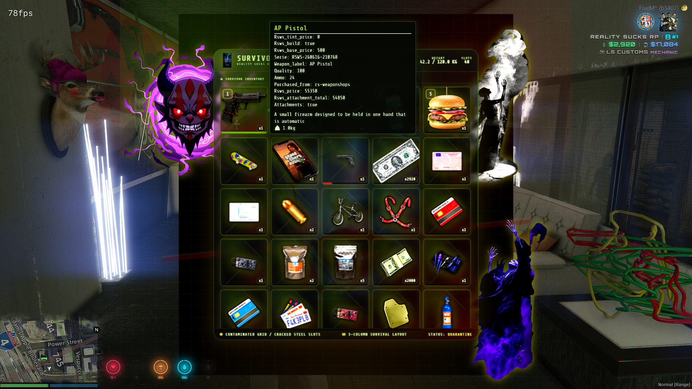

<p align="center">
  
</p>

<p align="center">
  <a href="https://reality-sucks-rp-webstore.tebex.io/package/7506318"></a>
  <a href="https://reality-sucks-rp-webstore.tebex.io/category/zombie-core"></a>
  <a href="https://reality-sucks-rp-webstore.tebex.io/"></a>
</p>

> I build my own FiveM scripts and complete server setups: zombie apocalypse systems, shops, weapons, phones, racing, customs, garages, dealerships, warfare, Phantom encounters, UI and more. My resources are tested in my own server builds and can be configured around the server owner's setup.

# 🧟 RealitySucksRP Zombie Inventory

### Open Source QB Inventory Rework

**Bring your FiveM inventory into the apocalypse.**

FULLY customizable — change menu images, move them around and make it your own.

**RealitySucksRP Zombie Inventory** is an open-source custom UI version of `qb-inventory` built for zombie, survival, post-apocalyptic, and dark RP servers. It keeps the familiar QB Inventory / APCode rework-style behavior while replacing the default look with a custom zombie-themed interface made to match the RealitySucksRP style.

This inventory was designed to pair perfectly with zombie servers, especially `rs-zombiecore`, but it does **not** require `rs-zombiecore` to run.

The goal is simple: keep the inventory working like players expect, but make it actually feel like it belongs in a zombie outbreak server.

## ☣️ What Makes This Different?

This is not just a basic color edit.

This version includes a full Zombie UI skin with custom menu artwork, darker glass panels, clearer slot layout, right-click options, attachment inspection, drop support, cash-as-item support, and HUD cash sync configuration.

The backend stays familiar. The look feels completely different.

## 🚀 Main Features

- 🔓 Open-source release
- 🧟 Custom RealitySucksRP Zombie UI
- ☣️ Dark survival / outbreak-style inventory design
- 🖱️ Right-click menu support
- 🎒 Use, Give, Drop, Split, Copy Serial, and Attachments options
- 🔫 Weapon attachment inspection panel
- 🔧 Remove weapon attachments from the inspection menu
- 📦 Ground item drops
- ✅ Drop confirmation window
- 🚗 Vehicle trunk and glovebox support
- 🗄️ Stash support
- 🛒 Shop support
- 🔢 Weapon serial support
- 🛡️ Item durability display
- 🔥 Hotbar support
- 💵 Cash-as-item support
- 💰 HUD money sync configuration
- 🩸 Marked / black-money item support
- ⏳ Item freshness / expiration support
- 🎨 Editable CSS
- 🖼️ Editable UI images
- 🖼️ Editable item images
- 🛡️ Server-authoritative reconciliation
- 🔒 Duplicate-request protection
- ↩️ Floor-drop recovery
- 🔄 Automatic cash-state correction
- 🔓 No escrow protection
- 📂 No `/assetpacks` dependency
- 🧩 Optional `rs-zombiecore` integration

## 🧟 Zombie UI

The menu includes custom zombie-themed visual layers and artwork such as:

- Zombie head art
- Skeleton art
- Dark background panels
- Survival-style menu feel
- Clearer item text
- Sharper slot numbers
- Better item readability

This makes it a strong fit for:

- Zombie RP servers
- Apocalypse servers
- Survival servers
- Dark RP servers
- Hardcore economy servers
- Custom QBCore servers

## 🎒 A Real Survival Inventory

Items can be moved, stored, dropped, recovered, traded, and managed through an interface designed around survival gameplay.

The Zombie edition preserves its dedicated apocalypse presentation while using server-authoritative synchronization underneath.

That is especially important in survival servers where one duplicated weapon, cash stack, or valuable item can damage an entire economy.

## 💵 Physical Cash & Black-Market Economy Support

The inventory supports physical cash while keeping it synchronized with the player’s actual server-side buying power.

Cash added through normal framework money functions can appear as a real item inside the inventory while remaining usable by shops and other resources.

If the player has:

**$34,601,900**

the inventory can display:

**$34,601,900**

instead of treating the money like a generic stack with an `x` count.

The synchronization system is designed to keep:

**Physical Cash → HUD Cash → Framework Cash → Purchasing Power**

aligned.

The Zombie edition also preserves support for marked-money and black-money style inventory items for underground and apocalypse economies.

## 🛡️ Hardened Ground Loot

Ground loot has been rebuilt around authoritative server state.

When a survivor drops an item, the server determines the real result and sends the finished player inventory and ground inventory back to the interface.

This helps prevent:

- Duplicate floor loot
- Ghost weapons
- Cash appearing in two locations
- Items disappearing until inventory is reopened
- Rapid-drop duplication attempts
- Failed bags permanently consuming items
- Stale inventory displays
- Rejected moves remaining visible locally

If a floor bag cannot be created correctly after an item is removed, the inventory includes recovery logic designed to return that item rather than silently destroying it.

## 🔫 Weapon Interaction

The inventory supports weapon metadata and attachment inspection.

Right-click actions can include:

- Use
- Give
- Drop
- Split
- Copy Serial
- Attachments

Attachment categories can include:

- 🔦 Flashlight
- 🎯 Optics
- 🔧 Grip
- 🔫 Muzzle
- 📦 Magazine
- 🎨 Tint / skin

## 🥩 Built for Survival Systems

The Zombie edition preserves additional systems intended for a more advanced apocalypse environment, including:

- Zombie/apocalypse inventory presentation
- Physical cash
- Marked and black-money item support
- Weapon inventory support
- Weapon attachment compatibility
- Item freshness and expiration support
- Ground loot
- Drop quantity confirmation
- Player-to-player transfers
- Gloveboxes and vehicle inventory
- Weight and slot management
- Hotbar support
- HUD cash integration
- AP-style backend compatibility
- Incident/robbery integration support
- Authoritative inventory reconciliation
- Duplicate-request protection
- Floor-drop recovery
- Automatic cash-state correction

## 🎨 Fully Customizable

Server owners can modify the menu presentation without rebuilding the inventory logic.

Editable areas include:

```text
html/main.css
html/index.html
html/images/
```

You can replace:

- Zombie art
- Skeleton art
- Server logos
- Background imagery
- Item images
- Branding
- Menu colors
- Image positions
- Image sizes

## 🧩 HUD Money Sync

This inventory includes cash-as-item support.

The included HUD config is only an example. It does not require the RealitySucksRP HUD.

Server owners can add their own HUD resource name and cash update event inside the config.

```lua
CustomHUD = {
    Enabled = true,
    ResourceName = 'my-hud',
    ExportName = nil,
    MoneySyncEvents = {
        'my-hud:client:updateCash'
    }
}
```

If you do not use a custom HUD sync event, leave this disabled.

## 📦 Dependencies

Required:

- `qb-core`
- `qb-weapons`
- `oxmysql`

Recommended:

- A QBCore-compatible HUD
- A QBCore-compatible banking system
- Item images inside `html/images/`

Optional:

- `rs-zombiecore` for a full zombie survival server experience

## 🛠️ Installation

1. Back up your existing inventory and player data.
2. Place the resource inside your server resources folder.
3. Make sure the folder is named `qb-inventory`.
4. Make sure `qb-core`, `qb-weapons`, and `oxmysql` start before it:

```cfg
ensure qb-core
ensure qb-weapons
ensure oxmysql
ensure qb-inventory
```

5. Configure cash, HUD sync, and inventory settings in `config/config.lua`.
6. Restart your server.

## ⚠️ Important Notes

This is an open-source release.

There is no escrow protection.

There is no `/assetpacks` dependency.

All Lua, HTML, CSS, JavaScript, config files, and UI images are editable subject to the applicable upstream license.

Server owners are responsible for setting their own HUD event if they want the inventory cash item to match their custom HUD money display.

The included HUD config is an example only.

## ❤️ Credits

Original QB Inventory by the QBCore Framework team.

Rework/APCode backend behavior by APCode.

Zombie UI, RealitySucksRP styling, synchronization hardening, polish, and release packaging by **RealitySucksRP**.

## 📜 License

This resource follows the original QB Inventory open-source license requirements.

Because this is based on QB Inventory, it remains open source.

You may edit, modify, and redistribute this resource under the same open-source license requirements.

---

# 🧟 RS Zombie Inventory

**Loot it. Carry it. Trade it. Drop it. Survive with it.**
